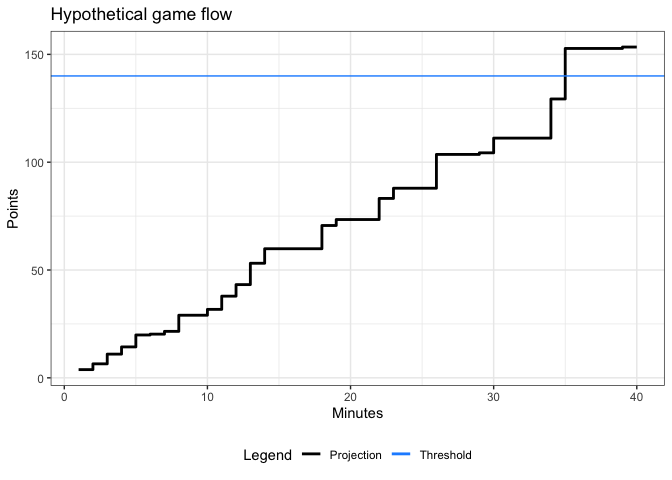

<!-- README.md is generated from README.Rmd. Please edit that file -->

# hoopTotals

<!-- badges: start -->
<!-- badges: end -->

There is a lot of research available for win probability models in
various sports. However, there is much less research in predicting the
number of points scored in a particular game.

This package implements the method described in the reference below, but
for NCAA Men’s Basketball, rather than the NBA.

Reference: Song, K., Y. Gao, and J. Shi. 2020. ‘Making Real-Time
Predictions for NBA Basketball Games by Combining the Historical Data
and Bookmaker’s Betting Line.’ Physica A 547: 1–8

## Installation

You can install the development version of hoopTotals from
[GitHub](https://github.com/) with:

``` r
# install.packages("devtools")
devtools::install_github("statistnick-tamu/hoopPackage")
```

## Functions

total: calculates expected points scored for a game train: calculates
parameters to pass into total for specific teams plotTotal: creates a
hypothetical scoring flow plot

## Example

Here is a quick example:

``` r
library(hoopTotals)
total(3.5,5)
#> [1] 140.2378
```

``` r
plotTotal(3.5, 5, 140, 144.5)
```


